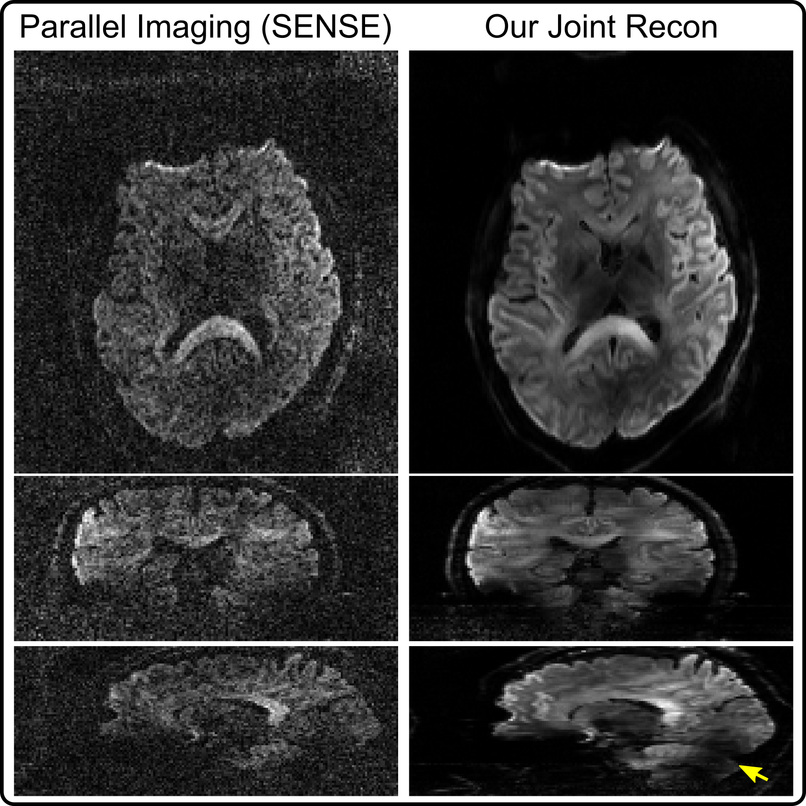
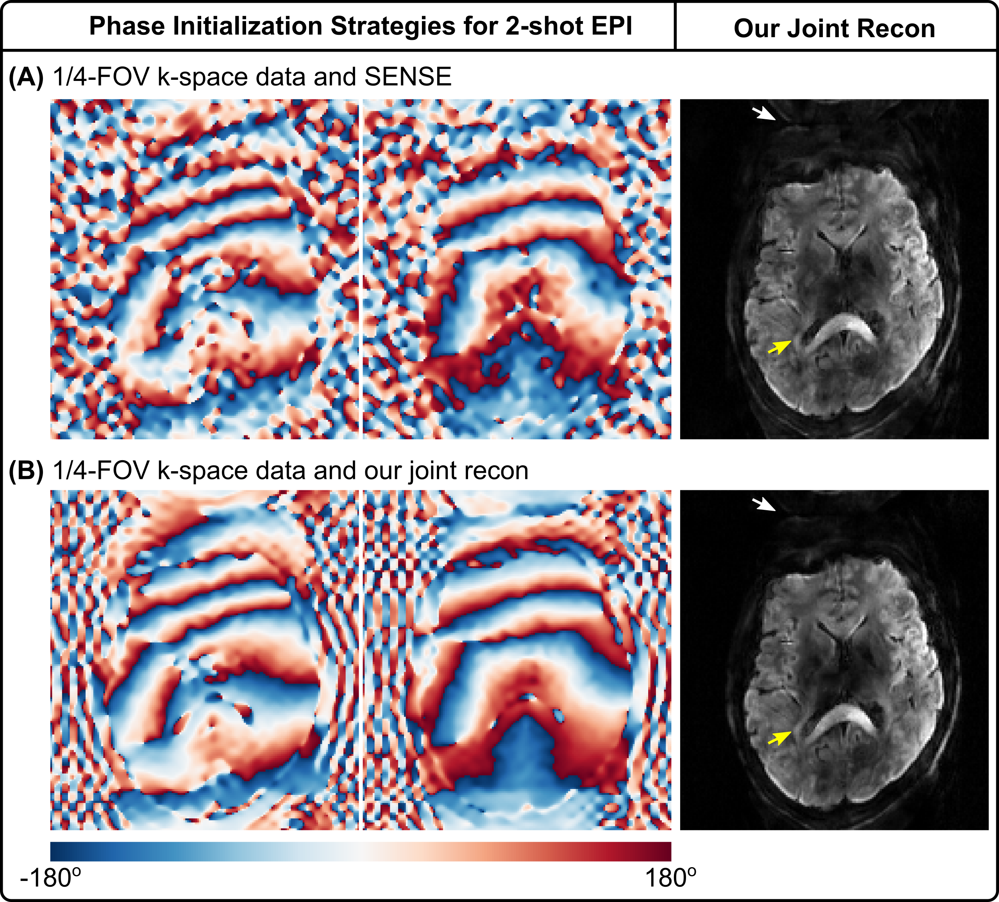
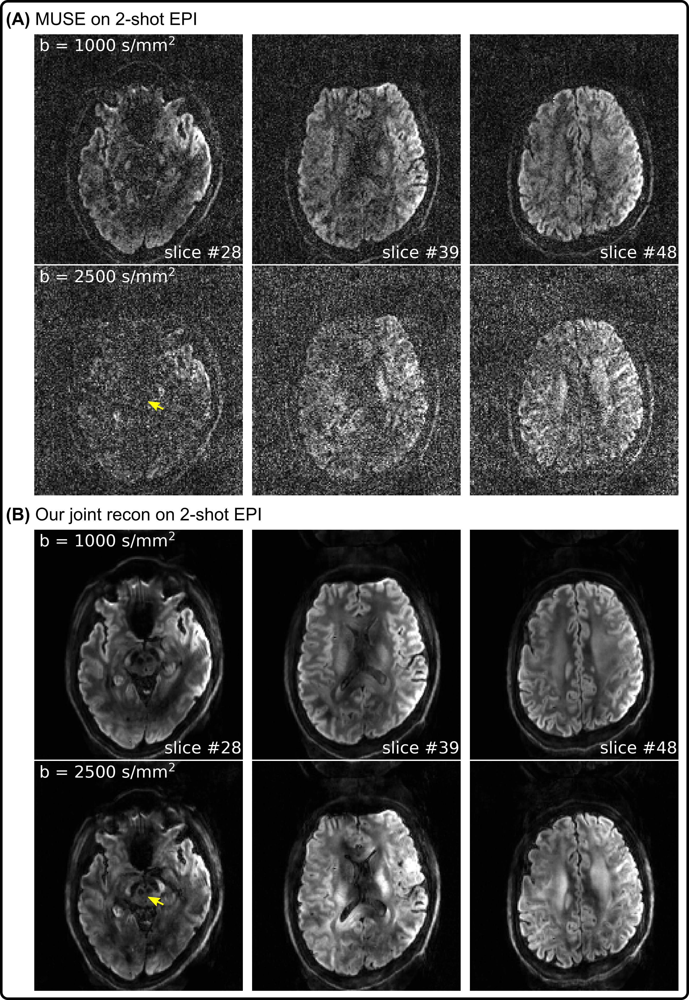
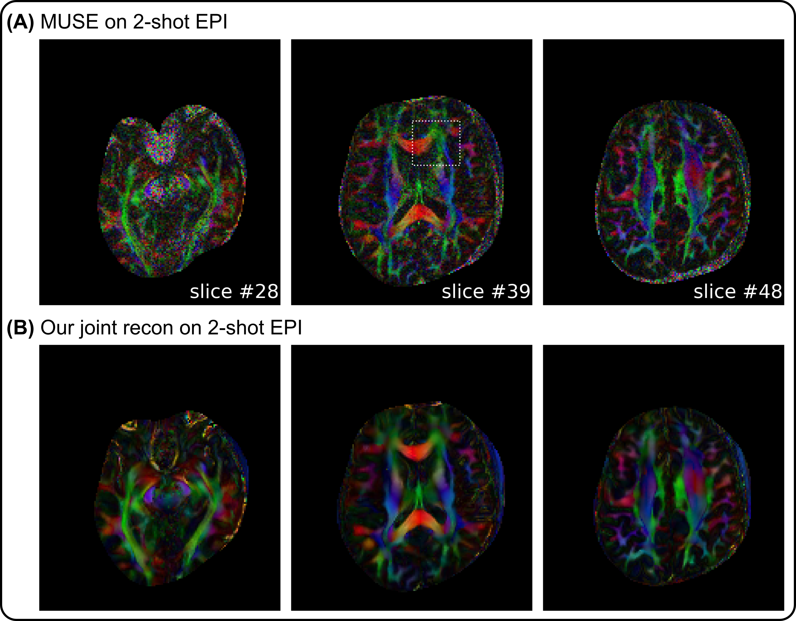
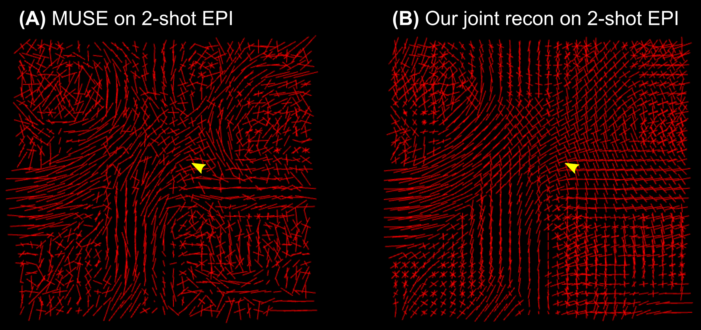

# ISMRM 2023

## In Vivo Diffusion MRI at 7T: High Spatial-Angular-Temporal Resolution Pursuit

Zhengguo Tan, Patrick A. Liebig, Robin M. Heidemann, Frederik B. Laun, Florian Knoll

### SYNOPSIS

The pursuit of high-spatial-angular-temporal resolution for in vivo diffusion MRI at 7T is challenging, but also receives continuous interest. We hereby propose shift-encoded interleaved EPI for multi-shell diffusion MRI and a joint reconstruction technique with LLR regularization. Preliminary results achieve up to 8.7-fold acceleration per shot in 2-shot EPI acquisition with 1.4 mm isotropic resolution. Moreover, with the integrated joint reconstruction for noise reduction, high-quality diffusion-weighted images render more spatially-continuous fiber anisotropy maps and clearer white matter fiber crossing in the fiber orientation distribution function.

### INTRODUCTION

The pursuit of ultra-high spatial-angular-temporal resolution diffusion MRI at ultra-high field strength (e.g. 7T) has been important in understanding brain microstructure and function. Such pursuit, however, encounters several technical challenges. First, increased susceptibility and shorter $T_2$ relaxation at 7T require faster echo train readouts in echo planar imaging (EPI) [1]. Second, high angular resolution in $q$-space requires the use of high or even multiple b-values, e.g. HARDI [2], which prolongs the scan time.

To address these challenges, we implement a modified interleaved EPI [3] sequence, achieving complementary $k$-$q$-space sampling. Moreover, we develop a joint reconstruction technique that accomplishes two tasks, (1) shot-to-shot phase variation estimation via joint shot and diffusion encoding reconstruction, and (2) shot-combined diffusion-weighted image update via phase-informed joint diffusion encoding reconstruction.

Here, we present two diffusion acquisition protocols based on 1- and 2-shot EPI, respectively. Single-shot EPI is widely used in clinical diffusion MRI but supplies limited spatial resolution. In contrast, multi-shot EPI can provide higher spatial resolution with shorter echo train length and reduced susceptibility.

### METHODS

For data acquisition, we employ the interleaved EPI sequence. Its in-plane sampling pattern is modified such as to realize one $k_y$ line shift per repetition with the cycling period as the undersampling factor per diffusion encoding. This creates complementary $k$-$q$-space sampling.

In vivo measurements were conducted at 7T (Terra, Siemens Healthineers, Erlangen, Germany) with single-slice excitation, 1.4 mm isotropic nominal resolution and 68 slices for whole brain coverage.

3-Shell diffusion sampling was used, with 20 directions for b-value 500 s/mm2, 30 directions for b-value 1000 s/mm2, and 64 directions for b-value 2500 s/mm2, respectively. b0 (non-diffusion-weighted) acquisition was interspersed every 10 diffusion encodings, resulting in a total of 126 diffusion sampling.

Three-fold in-plane acceleration and 6/8 partial Fourier were used, yielding 9 minutes and 15 minutes total acquisition time for 1-shot and 2-shot EPI, respectively. For 2-shot EPI, this corresponds to 8.7-fold acceleration per shot.

For image reconstruction, we jointly update all shot images by minimizing the following equation

$\sum_{j=1}^{N_\text{coil}} \sum_{s=1}^{N_\text{shot}} \sum_{q=1}^{N_\text{diff}}|| y_{j,s,q} - W_{q,s} F \{ c_j \cdot x_{q,s} \} ||_2^2 + \lambda ||x||_*$ &emsp;&emsp;&emsp; (1)

Here, $x_{q,s}$ represents the image from the $s$ th shot and $q$ th diffusion encoding. $c_j$ is the $j$ th coil sensitivity map estimated by ESPIRiT [4], $F$ is the 2D FFT, and $W_{q,s}$ is the sampling mask. We employ the locally low-rank (LLR) regularization [5,6,7,8], which has been implemented with integrated SigPy [9] and PyTorch features. Equation (1) generalizes to both single-shot and multi-shot EPI diffusion-weighted MRI reconstruction. To resemble SNR in multi-shot acquisition, shot-to-shot phase variation ($\theta_{q,s} = \angle{x_{q,s}}$) is extracted and incorporated into the forward model [10,11,12], thus

$\sum_{j=1}^{N_\text{coil}} \sum_{s=1}^{N_\text{shot}} \sum_{q=1}^{N_\text{diff}}||y_{j,s,q} - W_{q,s} F \{ c_j \cdot \theta_{q,s} \cdot x_{q} \} ||_2^2 + \lambda ||x||_*$ &emsp;&emsp;&emsp; (2)

The phase variation can be estimated either by parallel imaging or by our joint reconstruction formulation in (1) from the central k-space data. Minimizing Equation (2) supplies shot-combined diffusion-weighted images. The reconstructed diffusion-weighted images from both MUSE and our joint reconstruction were fed into DIPY [13] for the fitting of color-coded fiber anisotropy (FA) and fiber orientation distribution function (fODF) [14] maps.

### RESULTS

Preliminary results from in vivo measurements are shown as followed.

> **Figure 1**. Comparison of single-shot EPI diffusion-weighted images with b-value 2500 s/mm2 reconstructed by (left) parallel imaging as SENSE and (right) our proposed joint reconstruction, respectively. Displayed images are oriented in (top) axial, (middle) coronal, and (bottom) sagittal views.

As shown in Figure 1, diffusion-weighted images based on single-shot EPI and parallel imaging as SENSE [15] at high b-value (i.e., 2500 s/mm2) suffer from severe noise. This problem is alleviated using our joint reconstruction with LLR regularization. With single-channel RF excitation, residual B1 inhomogeneity is visible in the sagittal view (yellow arrow).

> **Figure 2**. Phase initialization in 2-shot EPI. **(A)** (Left) initialized 2-shot phase using SENSE on the self-navigated k-space data (cropped to 1/4 FOV) and (right) its corresponding joint reconstruction result. **(B)** (Left) initialized phases using joint reconstruction on the same cropped k-space and (right) its corresponding joint reconstruction. Joint reconstruction is beneficial for phase initialization. The thin fiber (yellow arrows) is only visible in 2-shot EPI, but not in Figure 1.

Figure 2 investigates phase initialization strategies. Reference methods [10,11] employ SENSE to reconstruct shot images, from which phase is extracted and smoothed. These methods, however, suffer from blurring and noisy artifacts in shot-combined diffusion-weighted images at high undersampling, as shown in Figure 2 (A). Figure 2 (B) shows that it is beneficial to use joint reconstruction in (1) for shot-to-shot phase variation initialization, which reduces background noise (indicated by white arrows).

Moreover, compared to the axial diffusion-weighted image in Figure 1, 2-shot EPI is capable of reducing spatial distortion, but also revealing the thin fiber surrounding ventricles (indicated by yellow arrows). This fiber structure is not visible from single-shot EPI, potentially due to spatial blurring and distortion. Note that the image contrast differs between 2-shot and 1-shot EPI, because of different TE used.

> **Figure 3**. Comparison of 2-shot EPI diffusion-weighted image reconstruction from **(A)** MUSE and **(B)** our joint reconstruction, respectively. For each method, two diffusion-weighted images with b values of 1000 and 2500 s/mm2 at three different axial slices are displayed. Clear delineation of the red nucleus (yellow arrow) is illustrated in joint reconstruction, whereas it is hindered by severe noise in MUSE.

Figure 3 compares 2-shot EPI diffusion-weighted image reconstruction results from MUSE [11] and our proposed joint reconstruction, respectively. Here, our joint reconstruction goes beyond one-by-one diffusion-weighted image reconstruction such as MUSE and exploits multi-dimensional low rankness. Note that the red nucleus is only visible from the joint reconstruction, whereas MUSE reconstruction suffers from severe noise at the high b-value (2500 s/mm2).

> **Figure 4**. Comparison of color-coded FA maps computed from diffusion-weighted images based on **(A)** MUSE and **(B)** our joint reconstruction, respectively. The region within the dotted rectangle is used for the calculation of fODF maps.

> **Figure 5**. Comparison of fODF maps within the dotted regions of the 39th slice in Figure 4 computed from diffusion-weighted images based on **(A)** MUSE and **(B)** our joint reconstruction, respectively. Compared to MUSE reconstruction, the fODF map from the proposed joint reconstruction displays clearer fiber crossing in the white matter (see yellow arrow).

The advantages of joint reconstruction with LLR are especially evident in Figures 4 and 5. First, the FA maps illustrate more spatial continuity compared to MUSE. Second, the fODF map displays clearer fiber crossing within white matter.

### DISCUSSION & CONCLUSION

This work develops a shift-encoded interleaved EPI sequence for high-resolution diffusion MRI at 7T, and a joint reconstruction technique with LLR regularization for high-quality diffusion-weighted image reconstruction. Preliminary results show that (I) the high spatial-angular-temporal resolution pursuit at 7T is plausible, (II) minimal geometry distortion and reduced ghosting can be achieved via self-navigated phase variation estimation and joint reconstruction, and (III) integrated reconstruction for noise reduction is advantageous for quantitative diffusion tensor imaging.

### REFERENCES

[1] Mansfield P. Multi-planar image formation using NMR spin echoes. J Phys C 1977;10:55-58. doi: 10.1088/0022-3719/10/3/004.

[2] Tuch DS, Reese TG, Wiegell MR, Makris N, Belliveau JW, Wedeen VJ. High angular resolution diffusion imaging reveals intravoxel white matter fiber heterogeneity. Magn Reson Med 2002;48:577-582. doi: 10.1002/mrm.10268.

[3] Butts K, Riederer SJ, Ehman RL, Thompson RM, Jack CR. Interleaved echo planar imaging on a standard MRI system. Magn Reson Med 1993;31:67-72. doi: 10.1002/mrm.1910310111.

[4] Uecker M, Lai P, Murphy MJ, Virtue P, Elad M, Pauly JM, Vasanawala SS, Lustig M. ESPIRiT - An eigenvalue approach to autocalibrating parallel MRI: Where SENSE meets GRAPPA. Magn Reson Med 2014;71:990-1001. doi: 10.1002/mrm.24751.

[5] Cai JF, Candes EJ, Shen Z. A singular value thresholding algorithm for matrix completion. SIAM J Optim 2010;20:1956-1982. doi:10.1137/080738970.

[6] Trzasko J, Manduca A. Local versus global low-rank promotion in dynamic MRI series reconstruction. Proc. ISMRM 2011;19:4371.

[7] Zhang T, Pauly JM, Levesque IR. Accelerated parameter mapping with a locally low rank constraint. Magn Reson Med 2015;73:655-661. doi: 10.1002/mrm.25161.

[8] Hu Y, Wang X, Tian Q, Yang G, Daniel B, McNab J, Hargreaves B. Multi-shot diffusion-weighted MRI reconstruction with magnitude-based spatial-angular locally low-rank regularization (SPA-LLR). Magn Reson Med 2020;83:1596-1607. doi: 10.1002/mrm.28025.

[9] Ong F, Lustig M. SigPy: A Python package for high performance iterative reconstruction. Proc. ISMRM 2019;27:4819.

[10] Liu C, Moseley ME, Bammer R. Simultaneous phase correction and SENSE reconstruction for navigated multi-shot DWI with non-Cartesian k-space sampling. Magn Reson Med 2005;54:1412-1422. doi:10.1002/mrm.20706.

[11] Chen NK, Guidon A, Chang HC, Song AW. A robust multi-shot scan strategy for high-resolution diffusion weighted MRI enabled by multiplexed sensitivity-encoding (MUSE). NeuroImage 2013;72:41-47. doi:10.1016/j.neuroimage.2013.01.038.

[12] Dai E, Mani M, McNab JA. Multi-band multi-shot diffusion MRI reconstruction with joint usage of structured low-rank constraints and explicit phase mapping. Magn Reson Med 2022. doi: 10.1002/mrm.29422.

[13] Garyfallidis E, Brett M, Amirbekian B, Rokem A, van der Walt S, Descoteaux M, Nimmo-Smith I, Dipy Contributors. DIPY, a library for the analysis of diffusion MRI data. Front Neuroinform 2014;8:1-17. doi: 10.3389/fninf.2014.00008.

[14] Tournier JD, Calamante F, Connelly A. Robust determination of the fibre orientation distribution in diffusion MRI: Non-negativity constrained super-resolved spherical deconvolution. NeuroImage 2007;35:1459-1472. doi: 10.1016/j.neuroimage.2007.02.016.

[15] Pruessmann KP, Weiger M, Scheidegger MB, Boesiger P. SENSE: Sensitivity encoding for fast MRI. Magn Reson Med 1999;42:952-962. doi:10.1002/(SICI)1522-2594(199911)42:5<952::AID-MRM16>3.0.CO;2-S.